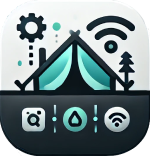

  
  <h1 style="margin: 0;">Technical Report for Smart Camping Application (TsaDiree)</h1>

**Developed by:** Dimitrios Lazanas P22082, Antonios Tsalmpouris P22272

## Table of Contents
1. [Project's Overview](#projects-overview)
2. [Prototyping and Resources used](#prototyping-and-resources-used)
3. [Programming Language](#programming-language)
4. [Project's Structure](#projects-structure)
5. [Components used](#components)
6. [Key Functionalities](#key-functionalities)
7. [Commands to start the Application](#commands-to-start-the-application)
8. [Notes](#notes)
9. [Conclusion](#conclusion)

## Project's Overview
This project is part of a school assignment (*University of Piraeus*) about Human-Computer Interaction.

Our goal was to develop a user-friendly Smart Camping Application, with focus on implementing industry-standard methods along the process.

In addition to the app, in the`/documents` folder you will find the user manual, technical report, and more app-related documents.

In the following sections, we will dive into some more technical details regarding the development of our the app.

## Prototyping and Resources used
**Where and Why:** The prototyping was done on Figma, a widely used platform for designing and testing UI/UX due to its collaborative features and ease of use.

**Icons:** Most of the icons used in our app are taken from [*Solar Icons Set*](https://www.figma.com/design/t8lJgHh6zVtNIOlZ3wBoAh/Solar-Icons-Set-(Community)?m=auto&t=xKg4hiPCRAvzQzAJ-6) library, which is available whithin Figma.

**Logo and Images:** The images used in our app, including App's Logo and the Camp's map where tailor made for our app using [*ChatGPT*](https://chatgpt.com/) as our AI image generator. Entering the right prompts helped us make our Logo unique, and representatory of our app's capabilies.

**Color Pallete:** We wanted our app's design to preserve consistency, while establishing a unique identity. In that direction, we decided to create our app's Color Palette. Using [*Coolors*](https://coolors.co/) as our tool, we created a color palette with colors directly derived from our logo.

**Chat Feature:** To implement the chatting feauture of our App, we have integrated one of the available models of the [OpenRouter](https://openrouter.ai/) API, and specifficaly the [Google's LearnLM 1.5 Pro Experimental](https://openrouter.ai/google/learnlm-1.5-pro-experimental:free) model. We did that to make the chatting feature smarter, and more interactive.

## Programming Language
**Our Choice:** The project uses *React* (with TypeScript). React was chosen for its robust component-based structure, reusability, and strong community support.

**Advantages for Users:**
- **Fast Performance**: React's virtual DOM ensures that updates are efficient, leading to faster load times and a smoother user experience.
- **Responsive UI**: React makes it easy to create responsive and dynamic user interfaces that work well on various devices and screen sizes.
- **Consistent User Experience**: React's component-based architecture ensures that UI elements behave consistently across the app.
- **Cross-Platform Compatibility**: With React, no installation is required as it is web-based, lightweight single-page application and it guarantees consistent user experience accross different platforms.

## Project's Structure
**Key Directories:**
- `src`: Contains the core application code.
- `app`: Likely for app-wide utilities or context.
- `assets`: Holds images or other static assets.
- `components`: Reusable components for the UI.
- `pages`: Different application pages.
- `index.tsx`: Entry point for the app.
- `public`: Static files and initial HTML template.
- `documents`: Additional documentation.

The project follows a modular structure, dividing responsibilities across components and pages.

## Components
**Origin:** All components were built manually to maintain consistency with the design and application requirements.

**Components used:**
- `BackButton`: A button component that navigates the user back to the previous page or screen.
- `ConfirmButton`: A button component used to confirm actions, often styled to indicate importance.
- `Header`: A component that displays the header section of the app, including the app title and navigation links. Is is used in every page.
- `HelpModal`: A modal component that provides help or instructions to the user. Becomes unique for each page.
- `InfoContainer`: A container component used to display informational content in a structured manner.
- `LSDLamp`: A specific component representing an LSD lamp, likely used for visual or interactive purposes.
- `MenuButton`: A button component that opens a menu or a feature.
- `Radio`: A radio button component used for selecting one option from a set of choices.
- `Select`: A dropdown select component that allows users to choose from a list of options (used in lighting settings).
- `Slider`: A slider component used for selecting a value from a range, often used in settings (used in custom lighting settings and the AC).
- `SoberLamp`: A specific component representing a lamp, similar to the `LSDLamp` but with different properties and visuals.
- `Switch`: A toggle switch component used for binary on/off states, such as enabling or disabling a feature (used for AC).

## Key Functionalities
- Functionalities are implemented using React hooks and TypeScript for type safety.
- Key functionalities include routing (react-router-dom), modals (react-responsive-modal), and state management through React's context or hooks.

## Commands to start the Application
- Install dependencies: `npm i`
- Start the development server: `npm start`

## Notes
- The project is configured with Webpack for bundling and TypeScript for enhanced type checking.
- The team adhered to linting standards using ESLint.

## Conclusion
The application's repository is hosted publicly on GitHub: [Find our repository here.](https://github.com/dimitry-lzs/hciWeb)