

  
  <h1 style="margin: 0;">User Manual for Smart Camping Application (TsaDiree)</h1>

**Developed by:** Dimitrios Lazanas P22082, Antonios Tsalmpouris P22272
### Overview
The **Smart Camping** application is your ultimate digital solution for an enjoyable and stress-free camping experience. This manual provides a comprehensive guide on how to use the features of the app. Whether you're setting up your tent, finding the best spot, or customizing your campsite environment, this manual will help you navigate the app with ease.

---

### Table of Contents
- [Finding the Perfect Spot for Your Tent](#finding-the-perfect-spot-for-your-tent)
- [Setting Up Your Tent](#setting-up-your-tent)
- [Placing Protective Cloths](#placing-protective-cloths)
- [Adjusting Light Settings](#adjusting-light-settings)
  - [Custom Lighting Settings](#custom-lighting-settings)
  - [Lighting for Special Occasions](#lighting-for-special-occasions)
- [Managing Solar Energy and Adjusting the AC](#managing-solar-energy-and-adjusting-the-ac)
  - [Solar Panels](#solar-panels)
  - [Energy Management](#energy-management)
  - [Air-Conditioning](#air-conditioning)
- [Checking the Weather](#checking-the-weather)
- [Ordering food](#ordering-food)
  - [Placing an order](#placing-an-order)
  - [Viewing past orders](#viewing-past-orders)
  - [Chatting with the Staff](#chatting-with-the-staff)
- [Engaging in Camping's activities](#engaging-in-campings-activities)
- [Using the Map](#using-the-map)
- [Notes](#notes)
- [Conclusion](#conclusion)

---

### Main Menu
Upon opening the app, you'll be greeted by the **Main Menu**. From here, you can select the feature you'd like to use by clicking the corresponding button. Each feature is designed to guide you through essential camping tasks, ensuring an efficient and enjoyable experience. Your options include:
- Tent Setup
- Protective Cloths Placement
- Lighting Settings
- Energy Management - AC
- Weather
- Activities
- Order
- Map

---

### Finding the Perfect Spot for Your Tent
1. Navigate to the **Tent Setup** section from the Main Menu.
2. A map interface will help you locate the ideal spot for your tent.
3. Review detailed information about each spot, such as soil stability,moisture level, and sun exposure.
4. When you have found your desired spot, simply click on it.
5. Once you’ve clicked on your spot, click **Confirm** to proceed.

Alternatively, you may select one of the suggested spots that are indicated using green targets.

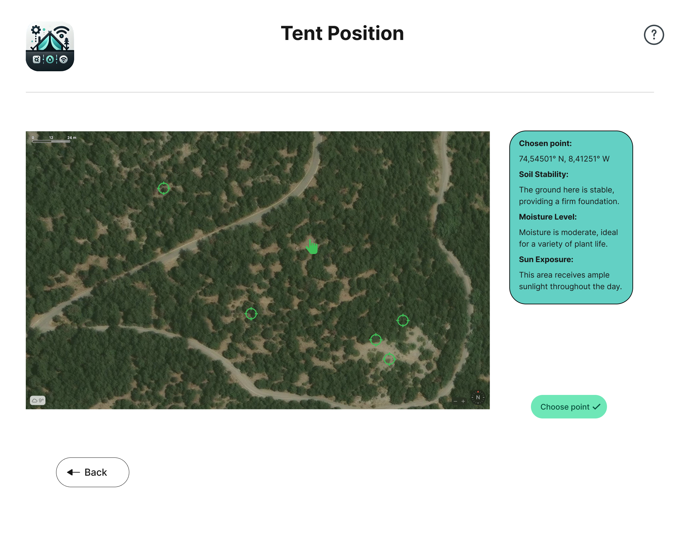

---

### Setting Up Your Tent
After confirming your location, you will be directed to the **Tent Setup**.
To complete your tent setup process, follow the steps described bellow:
   1. Using the horizontal arrows, select which pole you would like to place.
   2. Use the arrows to adjust pole's location.
   3. Use the arrows to install the pole into your desired depth.
   4. Repeat the same process for the other poles.

 Alternatively, for optimal pole placement, you may choose to apply system recommendations, simply by clicking the blue `Apply Suggested Settings` button.

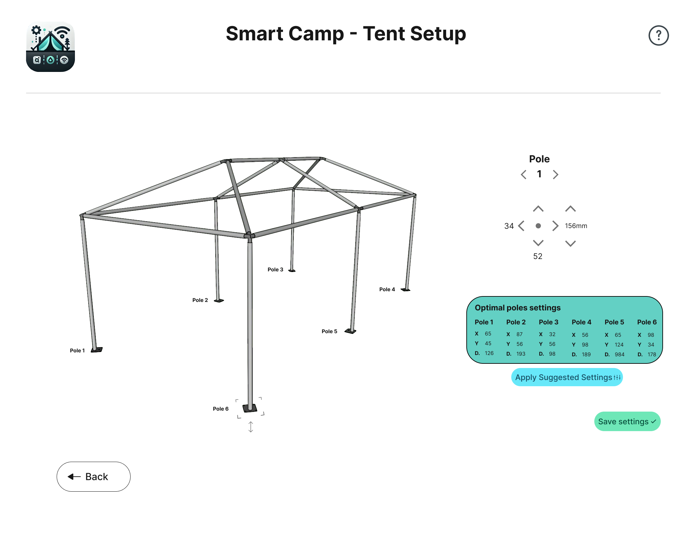

---

### Placing Protective Cloths
Whether you are setting up your tent for the first time, or you want to make any adjument on the proctive cloth, you may follow the steps bellow:
1. Navigate to the **Cloths** section.
2. Simply **drag & drop** the cloth that you see on the screen on your desired location.
3. System will provide you feedback about the validity of your choice.
4. If required by the system, **drag & drop** the cloth again until it meets systems requirements.
5. When you are done, click on the green `Save changes` button.

Alternatively, you may click the blue `Apply Suggested Settings` button, which automatically positions the cloths ensuring optimal wind protection.

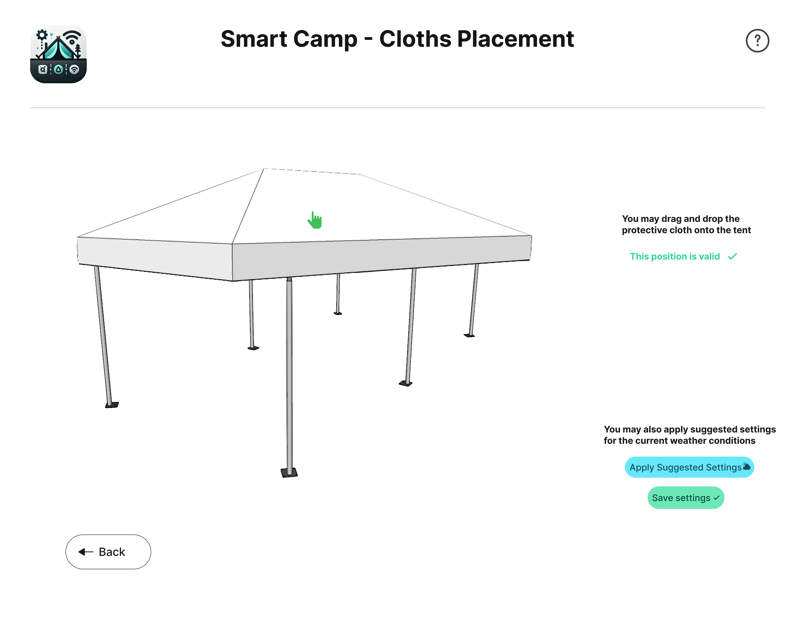

---

### Adjusting Light Settings
The app provides flexible lighting controls to ensure your campsite is well-lit and inviting. To select whether you want to make custom lighting settings, or pick one of the presets for special occasions, you have to click to the corresponding button of the following menu:

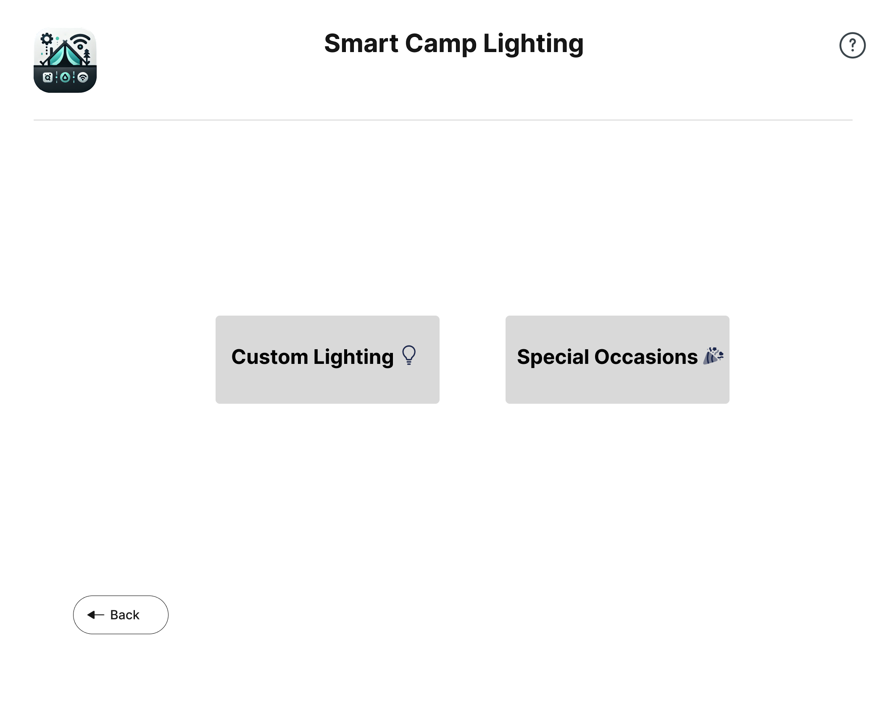 

#### Custom Lighting Settings
To set up custom lighting conditions follow these steps:
1. Open the **Lighting** menu and select **Custom Lighting**.
2. Adjust the following parameters:
   - **Brightness**: Slide the on-screen slider to increase or decrease light brightness.
   - **Warmth**: Using the slider adjust your light's warmth level.
3. When you are satisfied, click on the green `Save settings` button.

**Tip:** While experimenting with the sliders, take advantage of the virtual lamp, which provides feedback for you in order to get a taste of the changes you make.

If you don't have time for that, click the blue `Apply Suggestions` button to use recommended settings.

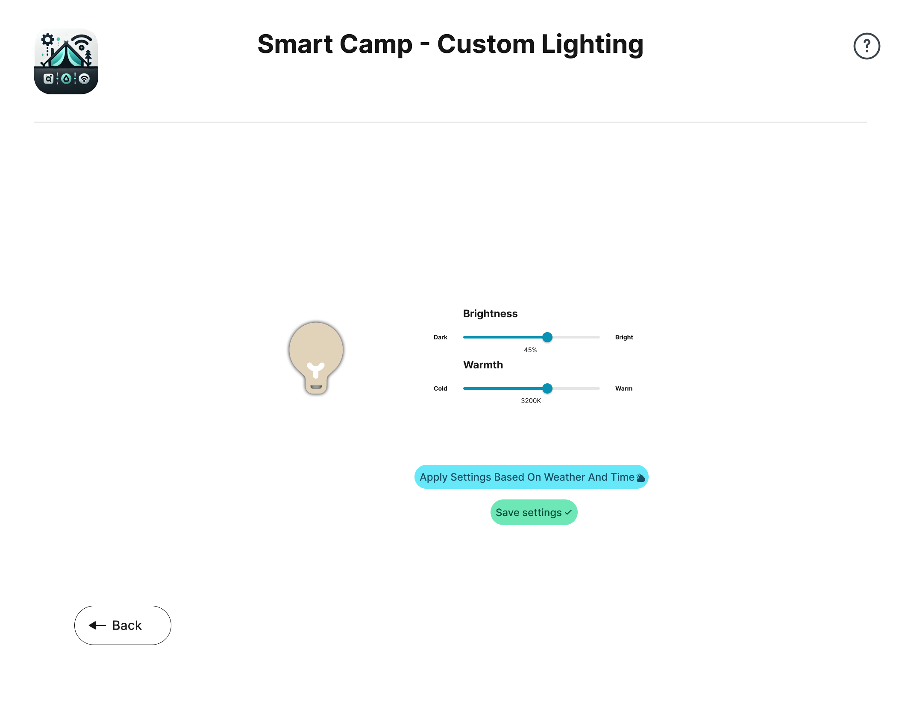

#### Lighting for Special Occasions
To select lighting conditions meant for special occasions, follow these steps:
1. Navigate to the **Lighting Menu** and then onto **Special Occasions** page.
2. Using the corresponding select box, choose one from the preset lighting scenarios (e.g., party mode, concert mode).
3. You will notice that the rest of the fields including the *colors*, *ligh play*, and *color switching pattern* will autocomplete themselves.
4. You are still able to make any change you want into the autocompleted fields simply by interacting with their controls. 
3. When you are satisfied, click the green **Save changes** button to apply your special theme.

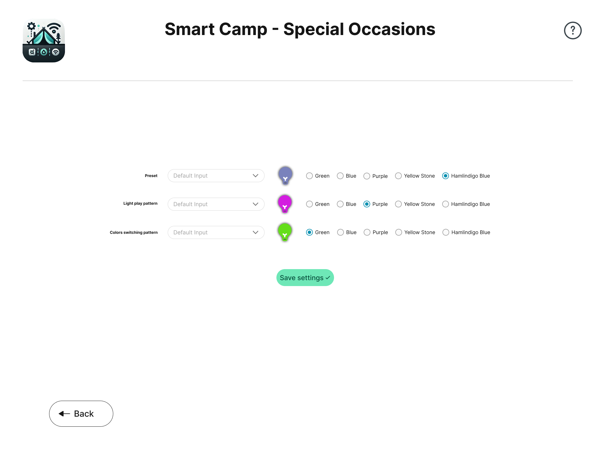

---

### Managing Solar Energy and Adjusting the AC
In this page, you can be informed about the energy available from the solar panels, adjust A.C. settings or even turn `Power-saving mode` on, in order to save some energy.

#### Solar Panels
The solar panels on top of the tent need sunlight to generate energy. Check the `Sun Exposure` value on this page to see if the panels are producing enough energy.

#### Energy Management
The green box in the center of the page shows **current energy capacity and consumption**. If capacity exceeds consumption, the text will be green. If not, the text will be red, indicating the need to **enable power-saving mode**.
- **To enable power-saving mode**, press the switch that has a battery icon.
- Once you have pressed the switch, you will notice AC to be automatically turned off, and your energy consumption to drop.

#### Air-Conditioning
This page gives you access to adjust **Air-Conditioning settings**. To use the Air Condition follow these instructions.
1. To turn the AC ON/OFF, use the switch at the top of AC's container.
2. Next, you have to select whether you want AC to transmit cold or warm air, by using the corresponding switch. When you are in cold mode, the switch will be blue, and when in heat mode the switch will be red.
3. Finally, virtually sliding on the slider, select your desired temperature. 

AC you will start now making you feel more comfortable!

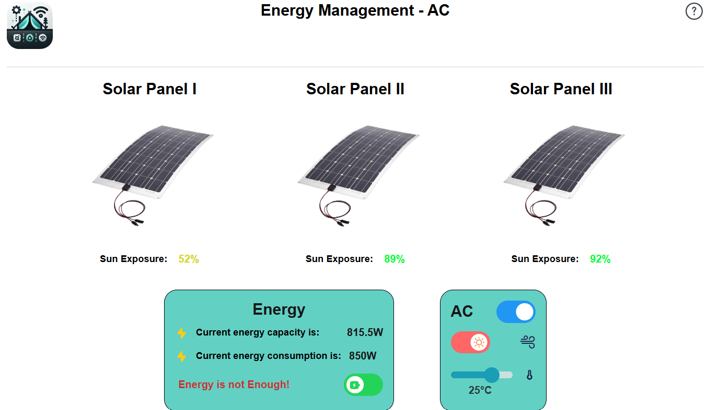

---

### Checking the Weather
Weather page is designed to inform you about the environmental conditions outside the tent. In detail you can get information about:
1. Current weather status (Sunny, Cloudy, Rainy).
2. Current temperature (Celsius).
3. Humidity percentage.
4. Wind's speed and direction.
After checking on weather conditions, **you may want to proceed to cloth placement changes**, in order to better protect your tent. That is why there is a button called `Cloths Adjustment` that guides you through this process:
- Click on the `Cloths Adjustment` button in order to get redirected into the [Cloths Placement Page](#placing-protective-cloths).

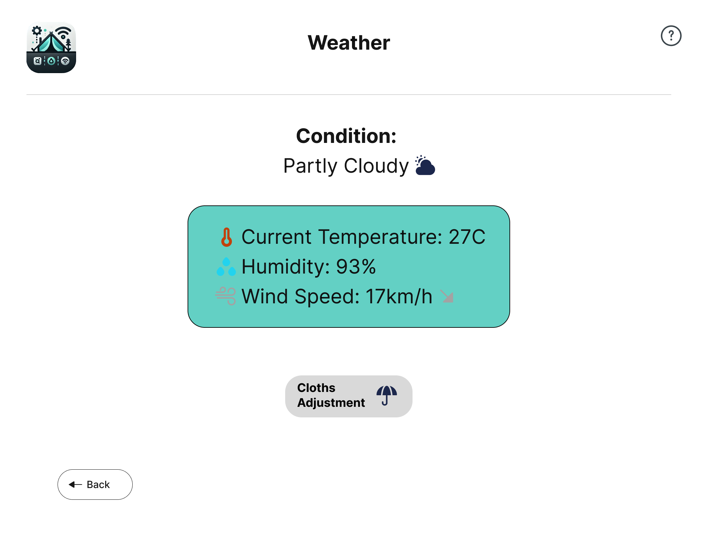

---

### Ordering food
Ordering page is there to help you `order your meal`, view your `past orders` and their status (delivered, pending, etc.), and `chat` with the camping staff for anything that concerns you about the food or the camping experience in general.

#### Placing an order
When placing your order you are just few clicks away from gettings your food delivered and eaten. The process is:
1. From the dropdown menu, pick your favourite restaurant.
2. Then, select you preffered meal bundle.
4. Lastly, pick a payment method (cash, card-payment).

#### Viewing past orders
On the right side of the screen you are able to see your `ordering history`. There, you can find information about all the orders you have made, including what you had ordered, order status (pending or delivered) and the payment method you used.

#### Chatting with the Staff
Right at the center of the page you can find the `chat-box` that you may use when you need any support from the camp's staff. To do so, use the chat-box like any chatting app you have used in the past. Specifficaly:
1. In the field bellow the conversation, type your message towards the staff.
2. When you have finished writing your text message, press the corresponding `send icon`, at the right.
3. Staff we will see your message and get back to you as soon as possible!

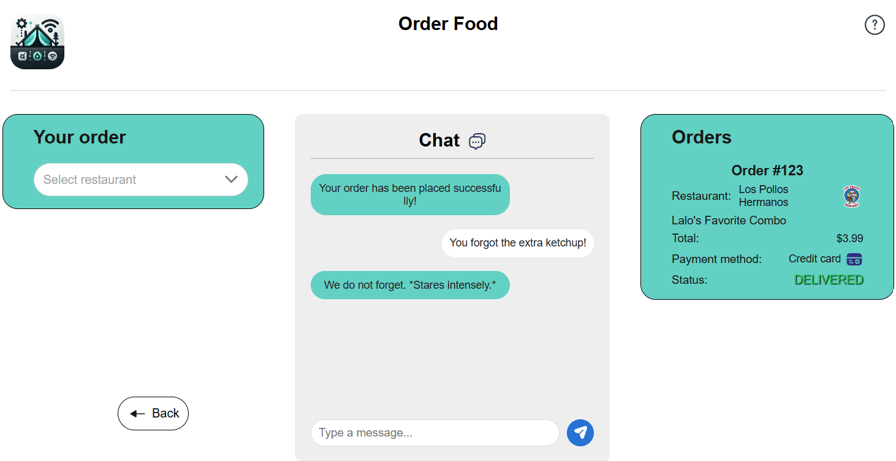

---

### Engaging in Camping's activities
In this page you can get informed about all the `upcoming-scheduled activities` in the camping. For each activity you can see what it is about. the place time it will take place, and until the deadline upon which the admission period ends. 

To actively take part into an activity you have to **get your admission**. To do so, simply click the green `Participate` button under activities info. 

**Notice:** If you have already applied for an activity, this button will be yellow so you know you have already taken admission.

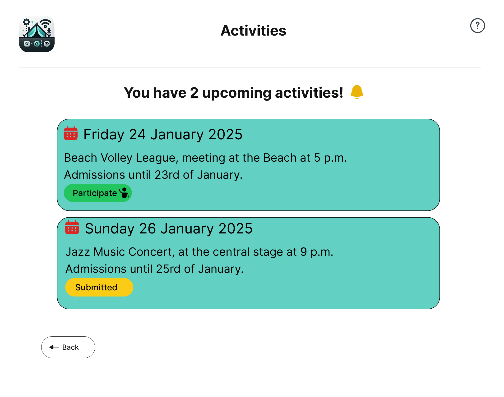

---

### Using the Map
In this page, you can interact with the campsite's map, get information about all the places that you can visit within the camping area, and also, navigate yourself using the GPS feature of the App.

Whether you are planning to go for a walk -to discover what our camping has to offer- or you want to know how to get to any place quickly and safely, you may use the GPS feature to guide you along the way. This page also provides you with important information like Day, Time, Weather Status, etc.

How to get the full out of the Map Page:
- At the left of the page you can get informed about campsite's most important places to visit.
- At the center of the page, you can interact with the map, see your current location, and click on the pins to see more information about each place.
- At the right, you may be informed about the current time/date, weather conditions, etc.

To use the GPS feature:
1. Click a pin on the map, to set it as your destination.
2. Once you have clicked on a destination, press the green `Navigate` button.
3. Follow the red line that showed up on the map, to reach your destination.

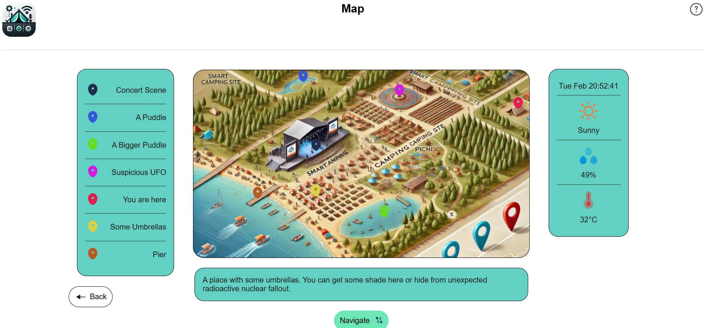

---

### Notes
- Each feature includes a help section accessible via the **Help** button in the top-right corner of the app.
- Also, each page has a **back button** that navigates the user to the previous page.
- You may also instantly move to the Main Menu by pressing the app's icon at the top-left of each page.
- Regular updates may introduce new features, so keep your app updated for the latest improvements.

---

### Conclusion
The **Smart Camping** app is designed to enhance your camping experience by simplifying essential tasks. Use this manual as a reference to explore and make the most out of its features. For more information, feel free to visit our [project repository](https://github.com/dimitry-lzs/hciWeb) or reach out via the support page.